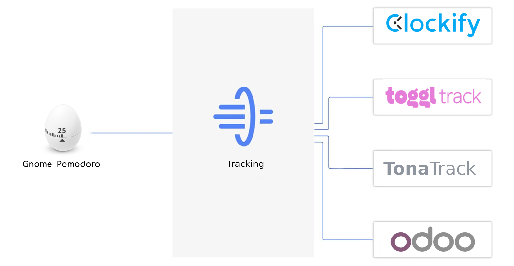

<p align="center">
  
</p>

<p align="center">  
  <a href="https://github.com/gnome-pomodoro/gnome-pomodoro-tracking/actions?query=workflow%3APytest">
    
  </a>
  <a href="LICENSE">  
    
  </a>
  <a href=".pm/version.yml">
        
  </a>
</p>

# GNOME Pomodoro Tracking
Lets you track your time with the popular time tracking services.

## Contents

* [Setup](#setup)
* [Command Line](#command-line)
* [Plugins]()
  * [Toggl](docs/toggl.md)
  * [Clockify](docs/clockify.md)
  * [Odoo](docs/odoo.md)
* [GNOME Pomodoro Settings](#gnome-pomodoro-settings)
* [Develop](docs/develop.md)


## Setup

###  Requirements
* python3
* [gnomepomodoro.org](https://gnomepomodoro.org)

### Install
```bash
# If you have installed v3, first uninstall old version
sh -c "$(curl -fsSL https://raw.githubusercontent.com/gnome-pomodoro/gnome-pomodoro-tracking/master/startup.sh)" "" --uninstall
```


```bash
pip3 install -u gnome-pomodoro-tracking
```
### Uninstall
```bash
pip3 uninstall gnome-pomodoro-tracking
```


## Command Line

```bash

usage: gnome-pomodoro-tracking [-h] [--plugin {odoo,clockify,toggl}] [-n]
                               [-r] [-k] [-s]
Optional arguments:
  -h, --help            Show this help message and exit
  --plugin  			Time Tracking Service
  -n, --name   			Pomodoro name
  -r, --restart         Pomodoro restart
  -k, --stop            Pomodoro stop
  -s, --status          Pomodoro status
  --time-entry			Create time entry
  --min-trace           Time minimal elapsed to track
  -d, --debug 			Enable debug

```


## GNOME Pomodoro Settings

`Preferences / Plugins ... / Custom Actions(Execute shell scripts) / Add `

```bash
gnome-pomodoro-tracking -gps "$(state)" -gpt "$(triggers)" -gpd "$(duration)" -gpe "$(elapsed)"
```

<p align="center">  
 
</p>