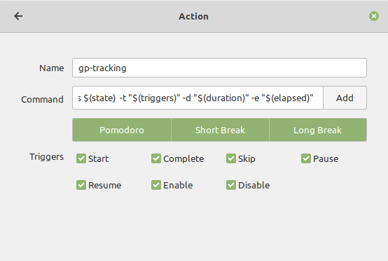

# Gnome Pomodoro Tracking


### Pre-requirements 

* git 
* gnome-pomodoro

### Install

```bash
sh -c "$(curl -fsSL https://raw.githubusercontent.com/josehbez/gnome-pomodoro-tracking/master/install.sh)"

```

### Uninstall

```bash
sh -c "$(curl -fsSL https://raw.githubusercontent.com/josehbez/gnome-pomodoro-tracking/master/uninstall.sh)"
```


### Set plugin tracking

```bash
gp-tracking -p clockify
```

### Plugins available

* [clockify](./plugins/clockify/README.md)

## Gnome-Pomodoro 

* Launch gnome-pomodoro. Preferences / Plugins ... / Custom Actions(Execute shell scripts)


* Launch gnome-pomodoro. Preferences / Custom actions ...  / add Action

```bash
gp-tracking -s $(state)  -t "$(triggers)" -d "$(duration)" -e "$(elapsed)"
```




## LICENSE

[GPL V3.0]( ./LICENSE)