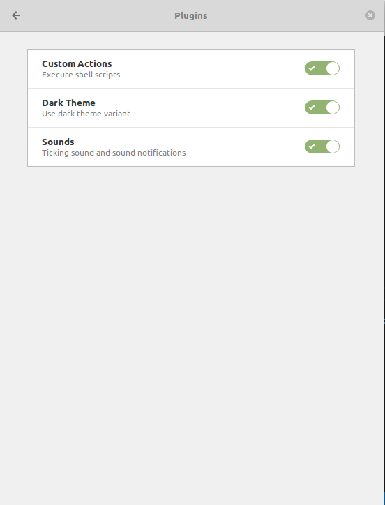

# Gnome-pomodoro & Clockify 


## Installation 

Clone 

```
git clone git@github.com:josehbez/gnome-pomodoro-clockify.git ~/.bin/gnome-pomodoro-clockify
```

Optional 

```
cd ~/.bin 
ln -s gnome-pomodoro-clockify/gp-clockify gp-clockify
```

### Clockify 

Generate token API in https://clockify.me/


Add token in  gp-clockify.cfg


### Gnome-Pomodoro 

Is required enable Plugins (Custom Actions -- Execute shell scripts)




Add action Clockify  and 

```
python3 ~/.bin/gnome-pomodoro-clockify/gp-clockify.py -e $(state) -t "$(triggers)" -d $(duration) -l $(elapsed)
```


## LICENSE

[GNU General Public License v3.0]( ./LICENSE)