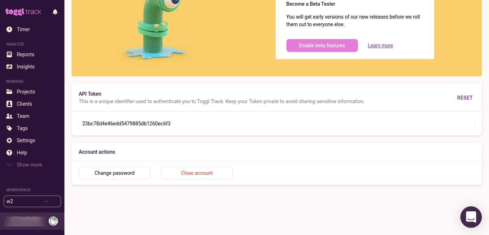

# toggl 

* Generate token API in https://track.toggl.com/profile



* Add token 

  ```bash
  gp-tracking --toggl-token TOKEN
  ```

* Workspaces
  * List
    ```bash
    gp-tracking --toggl-workspaces
    ```

  * Set
    ```bash
    gp-tracking --toggl-workspaces --set ID
  ```
  
* Projects
  * List
    ```bash
    gp-tracking --toggl-projects
    ```

  * Set
  ```bash
    gp-tracking --toggl-projects --set ID
  ```

