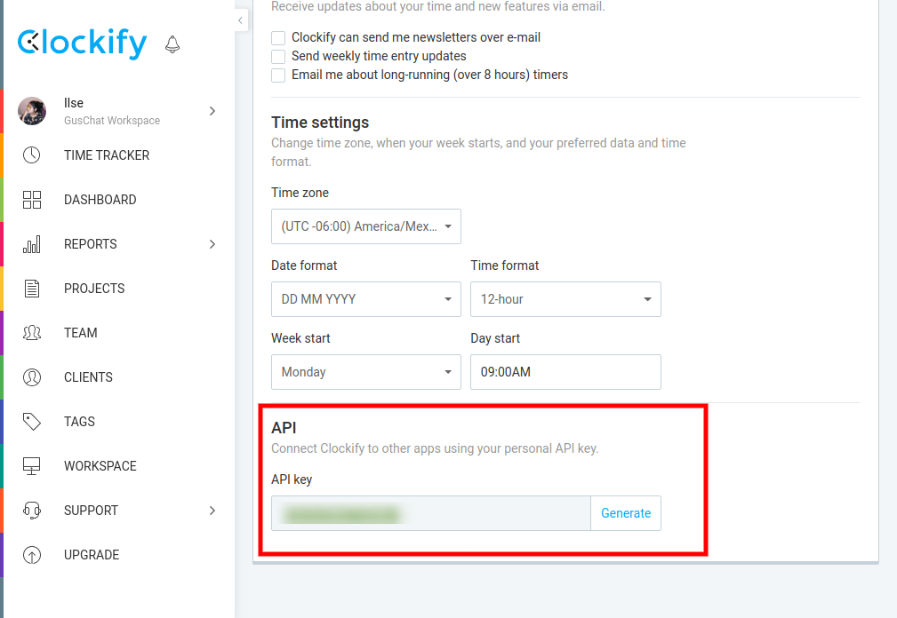
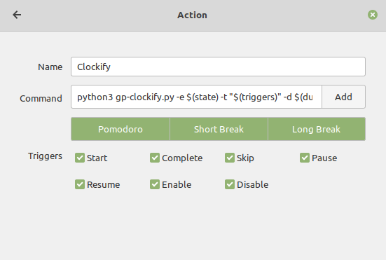

# Clockify 

### Clockify 

Generate token API in https://clockify.me/



Add token in  gp-clockify.cfg

<!--  -->

### Gnome-Pomodoro 

Is required enable Plugins (Custom Actions -- Execute shell scripts)


Add action Clockify  and 

```
python3 ~/.bin/gnome-pomodoro-clockify/gp-clockify.py -e $(state) -t "$(triggers)" -d $(duration) -l $(elapsed)
```


